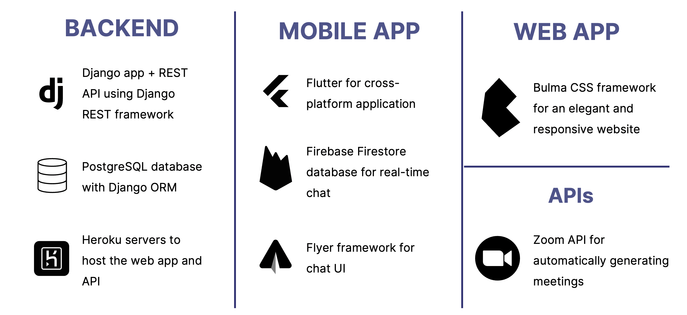
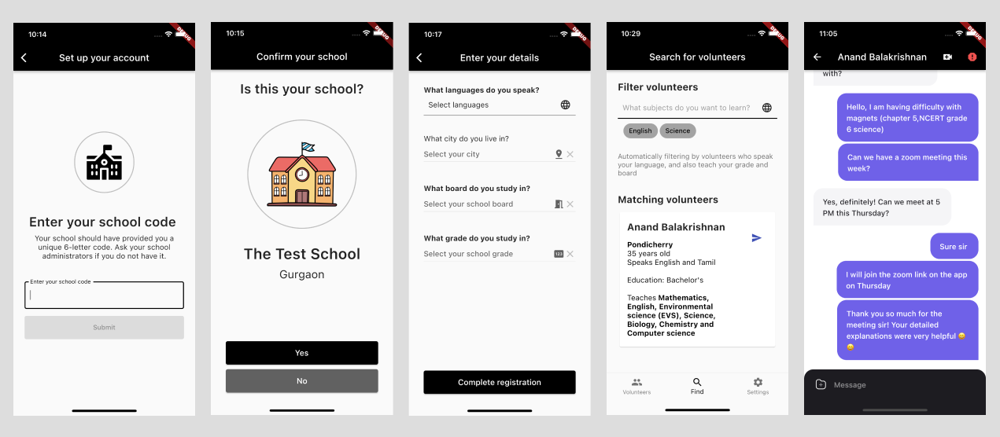
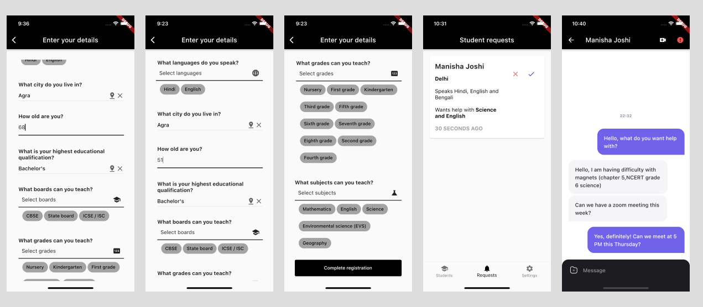
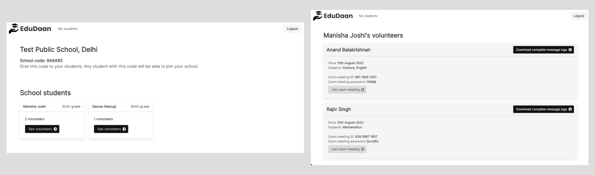

# EduDaan: a secure volunteer tutoring platform for schools and students

An all-in-one platform for facilitating volunteer tutoring. At the grand finale of the Government of India Smart India Hackathon 2022, this app was declared one of five winners nationwide in the 'Smart Education' category, and one of fifty winners overall across 3000+ submissions.

### What does it do?
The application allows students to find and learn from volunteer tutors in an all-in-one platform. It aims to address the learning gap created amongst the population of Indian school students by COVID-19.

As per recommendations from the 2020 National Education Policy, and research from KPMG, CII and JPAL, individualised volunteer tutoring can be tremendously effective to support the education of students. The goal of this application is to facilitate this.

### How does it work?
Volunteers create accounts in the app, entering key information about themselves such as their location, spoken languages, age, subjects, and educational qualification. 

Schools sign up on the platform and are provided with a unique 6-letter code. They provide this code to their students, who can use it to create accounts and send requests to volunteer tutors who match their personal requirements through a detailed interface.

Once a volunteer has accepted the request, they and the student can communicate entirely over the platform. They have access to a private text chat, with support for rich content, as well as the ability to schedule and join private Zoom links.

All of a student’s communication and activity ove the app is visible to the school on the admin dashboard to ensure the safety of students. 

You can view a full pitch deck [here](./slide_deck_sih_2022.pdf).

### Tech stack

### Screenshots from the app
 
 

You can view video demos of the app in operation [here](https://youtu.be/qmHgT-sOGIQ) and [here](https://youtu.be/5cQ7ElBzjz8). You can also find a full folder of screenshots [here](https://drive.google.com/drive/folders/13r1b8sHcZssZt7zCkjSxOoAn-bRYko8-?usp=sharing).
